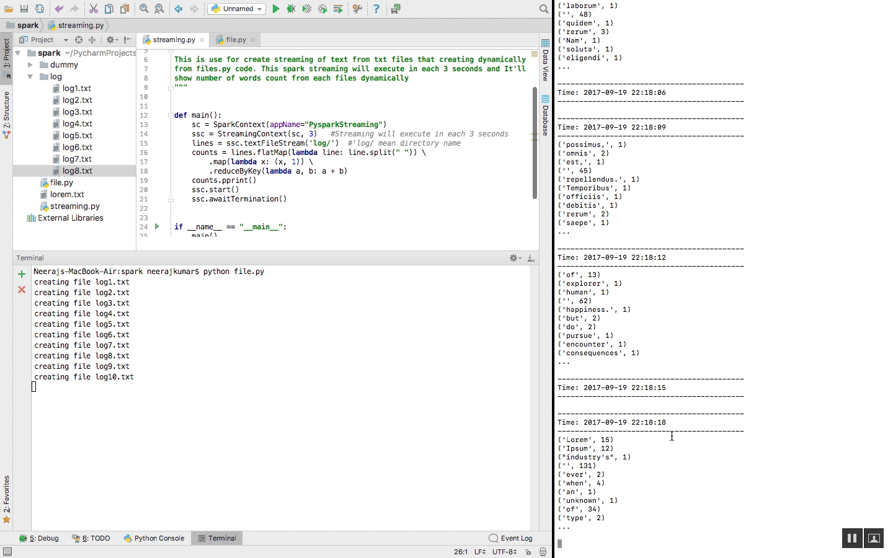

===============
Spark Streaming
===============

Overview
========

- In this tutorial, I'm showing spark streaming from txt file that reads spark dynamically

Requirements
============

- Configure Apache Spark
- install pyspark (Python Library) using pip install pyspark

Execution
=============

- Check video from youtube https://www.youtube.com/watch?v=bm28UYrYOeE

- Firstly Run spark streaming in ternimal using below command ::

   spark-submit streaming.py

   #This command will start spark streaming

- Now execute file.py using python that will create log text file in folder and spark will read as streaming ::

   python file.py

Output
======

